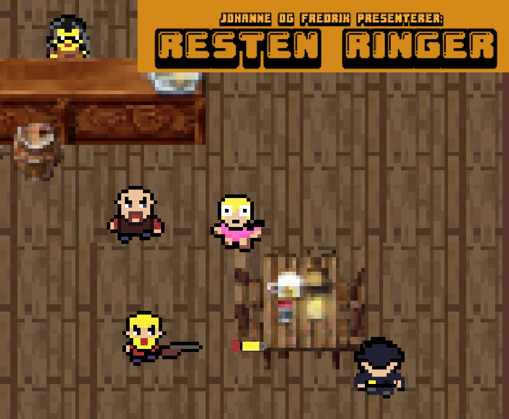

## Johanne og Fredrik presenterer Resten Ringer, laget med kjærlighet.

## Historie
Dette spillet handler om en vanlig kveld på byen.

Det var tirsdag formiddag og Johanne og Fredrik skulle ta seg en øl som de pleide på den lokale baren (det finnes bare én bar i Lier). Timene gikk, pils ble til shots og promillen steg, og da Fredrik begynte å programmere et spill i Java som omhandlet pils, hadde bartenderen fått nok. Johanne kom tilbake fra sin rutinemessige runde rundt bygget, iscenesatt av dørvakten, og fikk se det store spetakkelet som foregikk på dansegulvet. Klassisk utskjelling ble til fysisk vold, politiet ble tilkalt, og det ble nå om og gjøre for Fredrik og Johanne å forbli på baren. Valget stod nå mellom pils og død. 

I dette spillet må du kjempe mot alle som prøver å ødelegge kvelden. Om du ikke klarer det, ender du på glattcellen, mister promillen og spillet er tapt. Klarer du å bli i baren gjennom tre runder, vinner du spillet.

Lykke til!

## Hvordan spille Resten Ringer:
Spillet spilles ved at man bruker WASD-tastene for å bevege spilleren rundt i baren. Piltastene bestemmer hvilken retning man skyter.

## Youtube walkthrough
https://www.youtube.com/watch?v=-m3TrA11zJQ&ab_channel=JohanneSolheim

## Copyright
Resten Ringer er et spill hvor Johanne og Fredrik har alle rettigheter. Du kan derfor ikke publisere din egen versjon av Resten Ringer offentlig, skulle du ønske å lage et. Dette er kun for deg selv og dine aller nærmeste, og dere får kun gjenskape det med 	~~promille~~ ønske om å lære.

Dette spillet er utviklet av Johanne Martine Solheim-Midtsveen og Fredrik Åsheim Udengen (c) 2024. 

